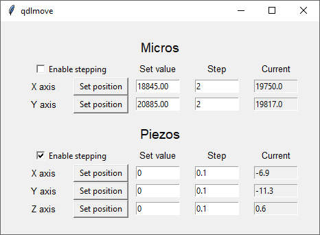

# `qdlmove`

`qdlmove` is a simple application for getting, setting, and stepping different axes of the various positioners used in a microscope setup. 
It has a generic structure capable being augmented to include additional positioners of different types (not necessarily just stage control but also automated mirrors, galvos, etc.).

## Configuration and start up
The base version of the `qdlmove` is configured for one two-dimensional positioner (usually the micrometers or "micros") and one three-dimensional positioner (labeled "piezos").
Different systems may require the removal of either of these (in the case that they do not exist) or augmentation in the event of additional "positioner" elements such as galvo mirrors for scanning or motorized mirror mounts for alignment.
However such flexiblity comes at the cost of requiring more involved configuration steps on the part of the user.
These steps are outlined below.

### Setting the YAML files
The YAML file sets the configuration of the different hardware components utilized for movement in any of the particular axes.
Each axis is kept separate to maximize customizability.
The general structure of the YAML file is as follows:

```
QDLMOVE:
  Positioners:  
    - MicroX
    - MicroY
    - PiezoX
    - PiezoY
    - PiezoZ

  MicroX:
    import_path : qdlutils.hardware.micrometers.newportmicrometer
    class_name  : NewportMicrometer
    configure :
      port: COM4
      min: 0.0 
      max: 25000.0
      timeout: 10  
  ...
```

Here the `Positioners` key contains a list of names for the controllers that are required.
In this case, we have two micrometer axes (`MicroX`, and `MicroY`) and three piezo axes.
During startup, the code will iterate through the `Positioners` list, locating the relevant entry in the YAML file (e.g. `MicroX`) and instantiate an object using the provided class and parameters.
In the above example, a `NewportMicrometer` object is instantiated on the serial port `COM4`.

You should add or remove controllers and their configurations from the YAML file as necessary.
Note that the names of the controllers are used to locate them at a later step and so you should pick names that are clear and concise.


### Reconfiguring the scripts
`qdlmove` was designed to be extremely flexible and (mostly) hardware agnostic.
This, however, comes at the expense of some additional configuration steps in the code itself.
Directions are provided in `main.py` and `application_gui.py` respectively for making these changes, but we repeat them here for clarity.

First you must edit `application_gui.py:__init__()` in order to add/remove the GUI elements for each controller.
There are natively two classes for the GUI elements that you can use: `TwoAxisApplicationView` and `ThreeAxisApplicationView`.
As the name suggests, these classes create the GUI elements for a two/three dimensional positioner respectively.
The lines
```
self.micros_view = TwoAxisApplicationView(
                        root_frame=frame, 
                        title='Micros', 
                        axis_1_label='X axis', 
                        axis_2_label='Y axis')
```
construct a view (GUI element) for the micrometers.
The `root_frame` argument should always be `frame` (this just tells Python where to place the GUI), and the arguments `title`, `axis_1_label`,  and `axis_1_label` can be any string -- these will be the labels which show up on GUI itself.
Note that these names have no bearing on the performance of the script beyond the labeling of the GUI elements.


Next you must modify `main.py` to link the GUI elements to the actual hardware controllers.
The lines which look like
```
self.micros_application = TwoAxisApplicationControl(
                            parent=self, 
                            gui=self.view.micros_view, 
                            axis_1_controller_name='MicroX', 
                            axis_2_controller_name='MicroY',
                            read_precision=0)
```
create a two/three axis controller for the application.
The `parent` argument should remain `self` as this links the controllers to the main application.
In the `gui` argument, you provided the corresponding "view" that you created in the previous step.
Here `self.view` refers to applications GUI class, and `micros_view` was the two-dimensional GUI element to control the micrometers.
Then supply the names of the axis controllers defined in the YAML file to the arguments `axis_1_controller_name` and `axis_2_controller_name`.
Finally, `read_precision` simply specifies the number of decimals to print out in the GUI.

## General usage



The application opens a GUI enabling you to input the position value and step size.
The current position is readout continuously (everytime it is updated) as well.
Once the desired position along a specific axis is placed into the GUI input element, the user may press the "Set position" button to drive the axes to the specific location.

Keyboard stepping is enabled by the checkbox "Enable stepping" at the top of each set on the GUI.
When enabled the keyboard arrow keys can be used to move the axes.
By default, the left `←` and right `→` specify movement along the first axis (typically the `x` axis) while the up `↑` and down `↓` keys specify movement along the second axis (typically `y`).
For three-dimensional positioners the `z` axis is linked to the equals/plus `=`/`+` to move up and the `-` keys to move down.
These work with number pad keys as well.

## Advanced topics

This section contains additional information required to modify the program itself.
As `qdlmove` is intended to be quite general, this is generally pertinent information for most users.

### Structure of the program
Like the other programs in `qdlutils`, the program is broken into three components: (1) a `main` which handles the back end of the application itself, (2) an `application_gui` which defines the application front end, and (3) an `application_controller` which interfaces the application with the hardware itself.
The reason for this separation is so that different hardware types can be "unified" at the `application_controller` level so that the application itself (in `main`) only needs to know about the `application_controller`.
You will find each of these components as their own `.py` files in `qdlmove`.

`main` contains the definitions of the `TwoAxisApplicationControl` and `ThreeAxisApplicationControl` classes with define the interfacing of the GUI input to commands sent to the `MovementController` class in `application_controller.py`.
The `TwoAxisApplicationControl` and `ThreeAxisApplicationControl` contain two or three functionally identical axes respectively.
The axes are more or less identical except for the keybinds.
Unfortunately, proper initialization of the system is not straightforwardly achieved (some hardware such as the NIDAQ voltage outputs do not store their current values).
As such some additional steps are taken to initialize the positions of the hardware on startup.
These are contained in the `isinstance()` checks at the end of the `__init__()` class methods.

The `MovementController` class in `application_controller.py` contains a ***dictionary*** of the classes representing actual hardware positioners called `MovementController.positioners`.
The names provided in the `.yaml` and definition of the `TwoAxisApplicationControl` and `ThreeAxisApplicationControl` classes in `main` correspond to the keys of the `MovementController.positioners` dictionary, with values of the keys being the class representing the specified hardware.
When `main` requests movement of an axis, the `MovementController.move_axis()` and `MovementController.step_axis()` methods are called passing the name of the desired positioner and information about the desired movement.
In the current implementation, these methods are effectively wrappers for the hardware class methods `.go_to_position(position)` and `.step_position(dx)`.
All existing and relevant hardware classes have such methods defined.

### Adding new hardware
To add new hardware one must define an appropriate controller class of the hardware.
This class can be stored in `qdlutils.hardware` under the relevant subdirectory.
Serial-based connections can be based off of `qdlutils.hardware.micrometers.newportmicrometer.py`.
New types of hardware may require separate development.
In any case, the current code is designed to call hardware class methods `.go_to_position(position)` and `.step_position(dx)` with argument signatures as shown.


If for some reason you need to operate with hardware classes with other call signatures for these types of motion (or without either of these methods), then the suggested solution would be to write a wrapper class for the desired hardware that implements methods with these call signatures and load this wrapper class with the `.yaml` file.
This could be achieved by inheriting from the original class, instantiating with a `super().__init__()` call, then writing new methods `.go_to_position(position)` and `.step_position(dx)`.
If either of these methods do not have a direct analog (e.g. if the hardware does not support absolute positioning), then you can simply write a null version of the method which does nothing.
This will prevent `qdlmove` from thowing an error.

Finally, you must also implement the logic for initialization in the two main classes of main `TwoAxisApplicationControl` and `ThreeAxisApplicationControl`.
If you need additional axes (or only one), then new classes can be written in `main`, e.g. `FourAxisApplicationControl`, which are effectively copy-pasted versions of the original two.
In the future, it might be ideal to have a new class `OneAxisApplicationControl` which the former, multi-axis classes simply instantiate multiple copies.
However we do not implement this now.