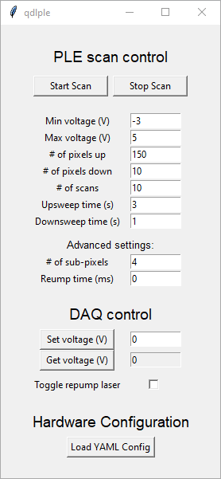
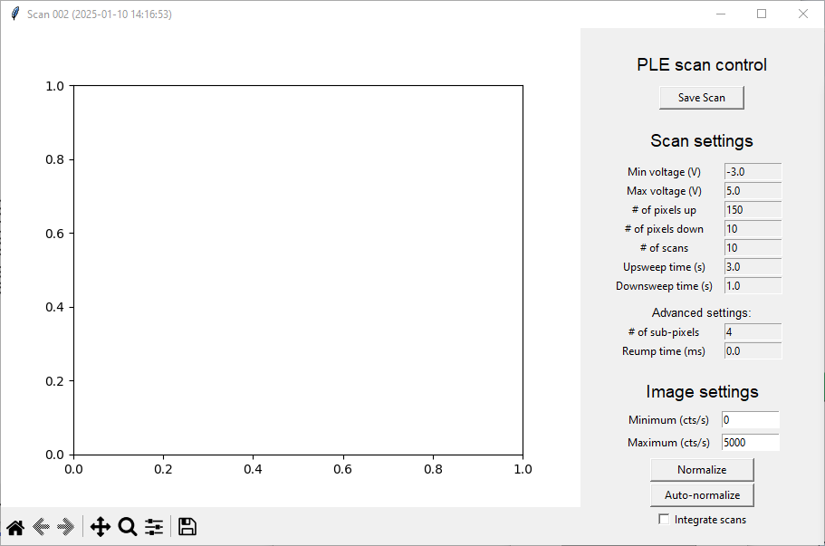

# `qdlple`

`qdlple` is a program for performing photoluminescence excitation (PLE) spectroscopy experiments involving correlated scanning of an excitation laser frequency and collection of the resulting PL signal.
The base configuration is designed to work with input and output via an NIDAQ board corresponding to the digital counter and voltage analog output signals respectively.
However, as with other the other programs in `qdlutils` it is generally straightforward to modify the software to work with alternative hardware.

## Configuration and start up

As with the other programs in `qdlutils` configuration is performed through the YAML file copied below in segments below.

The first block defines the application controller and class used to manage the hardware scans:
```
QT3PLE:
  ApplicationController:
    import_path : qdlutils.applications.qdlple.application_controller
    class_name : PleScanner
    configure :
      controller: VoltageController
      readers :
        - DAQCounter
      auxiliary_controllers :
        - RepumpController
```
If one wishes to operate with new hardware that is not controlled by the NIDAQ outputs, it is most straightforward to overwrite the `PleScanner` class itself to utilize the relevant hardware commands for the new hardware systems (provided approrpiate interfaces have been written).
This block additionally defines the `controller`, `readers`, and `auxiliary_controllers`.
In order these have the following purposes:
* `controller`: The hardware-interface class which manages the primary frequency control mechanism.
In this case it points towards the YAML entry under `VoltageController` which refers to the `qdlutils` class `NidaqVoltageController` (see the YAML configuration blocks below).
Since the frequency control is the "independent variable" of the scan, there can only be one `controller`.
```
  VoltageController:
    import_path : qdlutils.hardware.nidaq.analogoutputs.nidaqvoltage
    class_name  : NidaqVoltageController
    configure :
      daq_name : Dev1 
      write_channels : ao3  
      read_channels : ai3  
      min_voltage: -3  
      max_voltage: 5 
```

* `readers`: define the input sources.
In the current implementation only a single DAQ counter input reader is included but users can expand the list (and modify the application controller) to include additional input sources.
For example, this would be the appropriate place to track input from a powermeter (for normalization to the laser power variations) or wavemeter (to obtain high-resolution in-situ measurement of the laser frqeuency).
The names provided in the YAML file list are used to retrieve the readers in the software.
Of course, the additional functionality required to read and utilize the input data needs to be programmed in by the user as needed.
The `DAQCounter` reader is configured as shown below:
```
  DAQCounter:
    import_path : qdlutils.hardware.nidaq.counters.nidaqtimedratecounter
    class_name  : NidaqTimedRateCounter
    configure :
      daq_name : Dev1  
      signal_terminal : PFI0 
      clock_terminal :  
      clock_rate: 100000 
      sample_time_in_seconds : 1
      read_write_timeout : 10  
      signal_counter : ctr2  
```
* `auxiliary_controllers`: These are additional controllers used for intermediate steps in the scan loops.
For example, the current implementation utilizes a `RepumpController` (configured as shown below) in order to perform a repump between each subsequent scan in the loop.
This would also be the appropriate place to pass in controllers for simultaneous scanning of other hardware or for implementing other intermediate steps such as re-optimizing the position of the microscope.
```
  RepumpController:
    import_path   : qdlutils.hardware.nidaq.analogoutputs.nidaqvoltage
    class_name    : NidaqVoltageController
    configure :
      daq_name : Dev2 
      write_channels : ao0 
      read_channels :  reading position
      min_voltage: 0 
      max_voltage: 1 
```

Finally, as with the other programs in `qdlutils` it is recommended to modify the default scan parameters in the GUI to whatever is relevant to your system.
This can be achieved by editing the lines in `qdlple.application_gui.py` as shown below.
Specifically, users should modify the `input()` method calls in the `ControlPanel` class' `__init__` method:
```
ControlPanel():

    def __init__(self, root, scan_range) -> None:

        ...

        # Min voltage
        row += 1
        tk.Label(settings_frame, text="Min voltage (V)").grid(row=row, column=0)
        self.voltage_start_entry = tk.Entry(settings_frame, width=10)
        self.voltage_start_entry.insert(0, scan_range[0])
        self.voltage_start_entry.grid(row=row, column=1) 
```

## General usage

Similar to `qdlscan` launching `qdlple` will open up a "launcher" window as shown below:



Here the user may input settings describing the PLE experiment.
In the base implementation the laser frequency is correlated with the output voltage from one of the NIDAQ analog output channels.
As a result the `Min voltage` and `Max voltage` settings the define the minimum and maximum frequencies of a given scan respectively.
Note that a single scan is comprised of a full cycle of sweeping the voltage (and hence the frequency) from the minimum to the maximum and back.
The `# of pixels up` and `# of pixels down` describe the number of pixels at which data is recorded on the up/downsweep of the scan and the corresponding `Upsweep time` and `Downsweep time` define how long each of these sweeps take.

The advanced setting `# of sub-pixels` defines how many "sub-pixels" are sampled within any single pixel of the up/downsweep.
In the current implementation frequency points are sampled at the programatically defined points given by
```
upsweep_sample_frequencies = np.arange(min_voltage, max_voltage, n_pixels_up)
```
and likewise for the downsweep.
More details on the exact implementation are written as comments in the code itself.
The relevant point however, is that each of the `n_pixels_up` samples cover a bandwidth `(max_voltage - min_voltage) / n_pixels_up`.
In some cases this bandwidth may exceed the linewidth of features of interest which could diminish the signal significantly.
The "sub-pixel" averaging breaks each pixel into `# of sub-pixels` segements and then averages their signals.
This is advantageous to just sampling at higher density as it improves the SNR.
Note that this feature can significantly slow down the scanning if the number of subpixels becomes excessive (generally more than 4).
This is because there is a small overhead involved with changing the voltage and recording data at a given point.
Incidentially, this is the reason why some scans will take slighly longer than the desired time (especially if the number of pixels is large).
Therefore, it is recommended to reduce this paramter to 1 (i.e. no sub-pixel averaging) when the scans are sufficiently narrow bandwidth and high resolution.

The last setting `Repump time` defines the length of time that the reupump laser is turned on.
When non-zero, the repump laser is turned on for the specified time before the start of any given scan (full cycle of up and down sweep).
Currently the repump is mediated by the analog output from the NIDAQ, but the code is capable of being modified to use other signals (e.g. TTL, serial) if desired.

After setting the scan settings, pressing the "Start Scan" button begins the scan and opens a new window as shown below.
At any point, the user can press the "Stop Scan" button on the launcher to pause the scan loop, which will stop after completing the current scan.



The scan settings are shown on the side for convenience.
As scans are completed, data will begin to populate the figure on the left.
The normalization of the data visulaization can be modified by adjusting the minimum and maximum count rates on the "Image settings" options.
The option to "Integrate scans" averages each of the measured scans, compressing the 2-d scan data into a 1-d line (average counts as a function of frequency).
This option is useful for increasing SNR.
