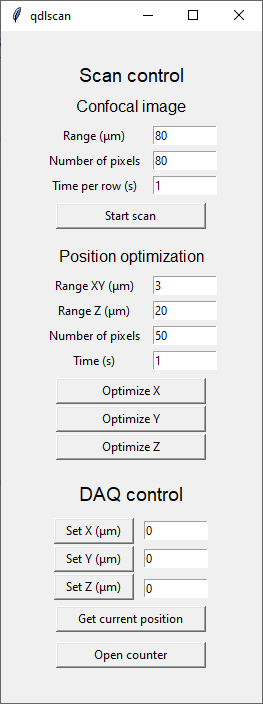
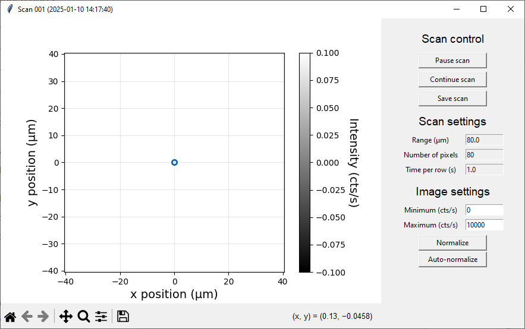

# `qdlscan`

`qdlscan` is one of the more complex applications used for performing confocal scans via coordinate movement and data recording via NIDAQ.
In principle it can be readily modified to work with other input and position control hardware.

## Configuration and start up

Configuration of the program for other NIDAQ hardware should be relatively straightforward.
The relevant part of the YAML configuration file is copied below:

```
QDLSCAN:
  ApplicationController:
    import_path : qdlutils.applications.qdlscan.application_controller
    class_name : ScanController
    hardware :
      counter : Counter
      x_axis_control : PiezoX
      y_axis_control : PiezoY
      z_axis_control : PiezoZ
    configure :
      inter_scan_settle_time : 0.01

  Counter:
    import_path : qdlutils.hardware.nidaq.counters.nidaqtimedratecounter
    class_name  : NidaqTimedRateCounter
    configure :
      daq_name : Dev1 
      signal_terminal : PFI0
      clock_terminal :
      clock_rate: 100000  
      sample_time_in_seconds : 1 
      read_write_timeout : 10 
      signal_counter : ctr2 

  PiezoX:
    import_path : qdlutils.hardware.nidaq.analogoutputs.nidaqposition
    class_name  : NidaqPositionController
    configure:
      device_name: Dev1    
      write_channel: ao0 
      read_channel:      
      move_settle_time: 0.0 
      scale_microns_per_volt: 8  
      zero_microns_volt_offset: 5
      min_position: -40.0  
      max_position: 40.0 
      invert_axis: True 

  PiezoY:
    ... # (Same as PiezoX but with different channel)

  PiezoZ:
    ... # (Same as PiezoX but with different channel)
```

Note that the PiezoX/Y/Z entries have the same structure but the Y/Z entries are omitted for brevity.

The first section `ApplicationController` dictates the application controller python module and contained class which is used by the application itself.
If hardware for stage control or data collection is not accessed via NIDAQ, the most convenient solution would be to write a new application controller class which inherits from the `application_controller:ScanController` class and overwrites methods to work with the new hardware.
You must also modify the entries in the YAML file for the PiezoX/Y/Z to point to the new hardware and with modified configuration parameters.

In most cases users will be using the NIDAQ for control and readout in which case the configuration parameters may simply be modified for the desired system.
Of primary importance is the `device_name` and `write_channel` configuration keywords which define the DAQ name and channel on the board.
The entry `scale_microns_per_volt` defines the conversion scaling factor between position controller's actual position (in microns) and the applied voltage at the DAQ output.
Correspondingly `zero_microns_volt_offset` defines the voltage value corresponding to zero microns on the positioner.
Likewise `max_position` and `min_position` define the maximum and minimum positions that the positioner is allowed to move to (in microns).
Note that the max/min position, zero-volt offset, and scaling factor should be chosen to be self consistent and within the range of the DAQ output but are generally arbitrary (depending on how one wishes to define the positioner coordinates).
Finally, the `invert_axis` option will invert the polarity of the voltage-to-micron version, swapping real-space position $x$ to $-x$.
This is a simple convenience feature which enables one to quickly swap the polarity without having to recalculate the conversion and offset factors.
Most users should set up each of the three axes in the same way then invert any axis using the `invert_axis` option as desired.
As each of the axes are defined individually, one may also have entirely different parameters for each axis if desired or necessitated by the hardware.

Some final points regarding the YAML configuration:
* The `interscan_settle_time` variable defines the wait time in seconds between subsequent single-axis scans in the confocal image.
If you find that vibrations are problematic between scans, increasing this may improve the behavior.
Note that it will also increase the total image scan time linearly.
* The `Counter` configuration settings should also be modified; particularly the `daq_name` and `signal_terminal`.
Other settings can be left as default unless the user requires additional modifiations.
Specifically, `sample_time_in_seconds` is overwitten dynamically and can be left as 1 by default.
Additionally, the `clock_rate` can be modified if higher precision is needed for faster scanning, however it is generally not necessary nor recommended to do so.

Finally, it will also generally be recommended to modify the default settings of the GUI to match your hardware.
This can be achieved by modifying lines in the `application_gui.py:LauncherControlPanel.__init__()` method.
Specifically within each input field is defined by a block of code like:

```
    # Range of scan
    row += 1
    tk.Label(scan_frame, text='Range (μm)').grid(row=row, column=0, padx=5, pady=2)
    self.image_range_entry = tk.Entry(scan_frame, width=10)
    self.image_range_entry.insert(0, 80)
    self.image_range_entry.grid(row=row, column=1, padx=5, pady=2)
```

This is specifically the "Range" input for the confocal scanning.
The current default range is set to 80 microns in the line `self.image_range_entry.insert(0, 80)`.
Simply change the `80` value to whatever you desire for the range default value.
Repeat this for the other entries as well as needed.


## General usage

When launching the application the "launcher" is opened as shown below.



There are two main operation modes: (1) confocal image scanning and (2) single-axis scanning.
These are controlled by the "Confocal image" and "Position optimization" sections respectively.
Most of the inputs are straightforward -- the confocal or line scans will scan axes over the specified "Range" (in two or one axes respectively) in "Number of pixel" steps.
The time per scan in a single axis is given by "Time per row" and "Time" inputs respectively.
Pressing "Start scan" will open a new GUI windown shown below for the given scan.
Pressing "Optimze X/Y/Z" scans the respective axis.



At any point you can pause the scan using the "Pause scan" button.
The scan will finish the current row and then pause.
From here you can either launch a new scan via the original "launcher" window or continue the scan via "Continue scan".
Data is saved via the "Save scan" button.
Note that you can modify the normalization of the image by setting the "Image settings" on the bottom.

