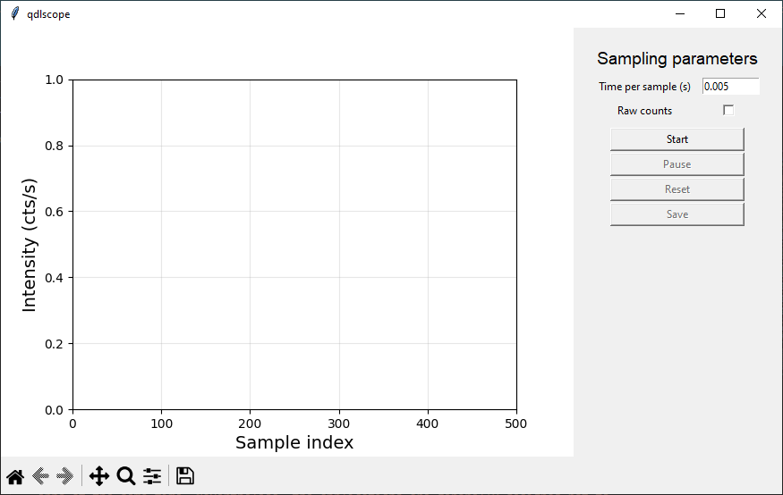

# `qdlscope`

`qdlscope` is a simple application for reading the output in real-time from a NIDAQ counter (typically connected to an SPCM).

## Configuration and start up
The base version of `qdlscope` is intended to operate with the `qdlutils.hardware.nidaq.counters.nidaqtimedratecounter:NidaqTimedRateCounter` class.

### YAML configuration

The default `.yaml` configuration file is 

```
QDLSCOPE:
  ApplicationController:
    import_path : qdlutils.applications.qdlscope.application_controller
    class_name : ScopeController
    hardware :
      counter : Counter

  Counter:
    import_path : qdlutils.hardware.nidaq.counters.nidaqtimedratecounter
    class_name  : NidaqTimedRateCounter
    configure :
      daq_name : Dev1
      signal_terminal : PFI0 
      clock_terminal :
      clock_rate: 100000 
      sample_time_in_seconds : 1 
      read_write_timeout : 10
      signal_counter : ctr2 
```

For most users with similar system structure, it should be sufficient to simply modify the `Counter` properties to match the system of interest.
Specifically one can modify the `daq_name`, `signal_terminal`, and `signal_counter` as needed.
It may also be of interest to modify the `clock_rate` if higher precision in the sample time is needed but this is generally not relevant.
Additionally note that the `sample_time_in_seconds` is modified dynamically and can be left as the default.


## General usage

The basic GUI is shown in the figure below:



First set the "Time per sample" in seconds to the desired length; the default value is typically sufficient for most purposes.
Note that the time per sample is ***not*** the time period between samples, but is instead how long the counter integrates for per sample.
Instead, the time between samples is slightly longer due to computational overhead.
More discussion of this is provided in the *Advanced topics* section.

To start the counter hit the start button.
Data will begin to populate the plot on the left.
Once more than 500 samples have been recorded, the display will start to roll forward with the newly aquired data (i.e. data from > 500 samples before the current will not be shown).
Nevertheless, the data is still being recorded internally and can be retrieved at a later time if desired.

When the counter is running you can hit the "Pause" button to stop the counter temporarily, and then save the data via the "Save" button.
The counter can be resumed using the "Start" button again, or reset using the "Reset" button.
Note that the data record does not keep track of any pauses in the current implementation and so the time-stamps of the data stream will be incorrect if a pause is performed.
Additionally, to ensure consistency, the "Time per sample" is fixed until the "Reset" button is pressed.
Resetting the system deletes the currently cached data.


## Advanced topics

### Timing the samples
Based off of some testing, the current implementation has a flat time overhead of approximately 50 ms for each sample.
It appears that most of this time is due to the plotting, however some 1-10 ms or so is due to the overhead for launching the counter task at each sample (discussed in the next subsection).

In order to handle properly timing the data collection samples, the software records the time the sample was taken relative to when the start button was pressed.
As a result the timing after a pause will be incorrectly matched to the previous data and so care should be taken to not confuse things.

### Counter overhead and modifying the sampling
Part of the reason for the slow overhead is that each sample opens a new task on the DAQ which requires the clock to be started and a new session to be formed.
This also means that the timing between data samples is not exactly reliable since this time is not controlled by any external clock.
If higher precision is needed then one could operate in a batched sampling mode wherein samples are read out from the DAQ in batches of defined size and time period.
This is equivalent to running multiple samples without any overhead between samples.
The drawback of this approach is that data cannot be readout while the batch is being sampled.
This feature is not implemented in the application itself, but is implemented in principle in the `application_controller` class if someone is interested in this functionality.
All that would be required is to create a GUI and impelemnt the backend logic on the app itself.